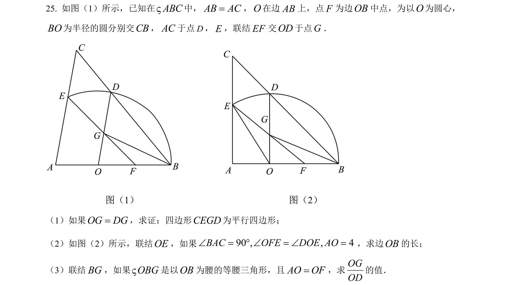

- 三角 余弦定理 三角函数 角度 长度
- 使用三角函数做桥梁构造方程
  - 可以把复杂的逻辑关系转变为纯粹的解方程
  - 虽然有些时候方程列出来但解不出来
    - 但是在这个题目中是可以解出来的
  - (1) 也许列方程应该是最值得优先尝试的策略
  - (2) 或者是当你一筹莫展的时候应该考虑试试列方程
- 三个小问条件在脑中很容易产生混乱干扰
- 图中明明有个圆，但是几乎用不到圆的任何性质
- 重新绘制图形，把约束条件层层叠加就能看出其中的关系
- 重新表述整个元素及其关系
  - 三角形ABC与三角形OBD都是等腰三角形
  - 三角形ABC与三角形OBD是共顶点的相似关系
  - OD始终平行于AC
    - 以A点为中心圆心，AC边逐渐抬起，即角A逐渐变大
    - AC为主动，OD为联动，因为OD需要跟随AC维持平行关系
      - 第一小问，OF=OB且OG=DG，则EF与CD平行，加上OD平行与AC，所以命平行四边形成立
      - 第二小问，把所有已知条件向三角形AFE与三角形OFG聚合
        - 令X=角AEO=角DOE=角AFE OB=OE=2*OF
        -  (AO+OF)*tan(X)=AE=OE*cos(X)
        - 得到 4*sin(X)*sin(X)+sin(X)-2=0
          - 解二次方程得到 sin(X)=(-1+sqrt(33))/8 =4/OB=OA/OE
      - 第三小问，需要明确指出OG为底BG为腰
        - 搜集已知信息 2*OA=2*OF=2*FB=OE=OD=OB AE=2*OG
          - 三角形AOE cos(A)=(OA*OA+AE*AE-OE*OE)/(2*OA*AE)
          - 三角形OBG cos(O)=(OG/2)/OB
          - (OA*OA+AE*AE-OE*OE)/(2*OA*AE)=cos(A)=cos(O)=(OG/2)/OB
            - 令OA=1，则(1*1+4*OG*OG-2*2)/(2*1*2*OG)=(OG/2)/2
            - 计算得到 OG=1  所以OG=OA=OB/2=OD/2  OG/OD=1/2
  
