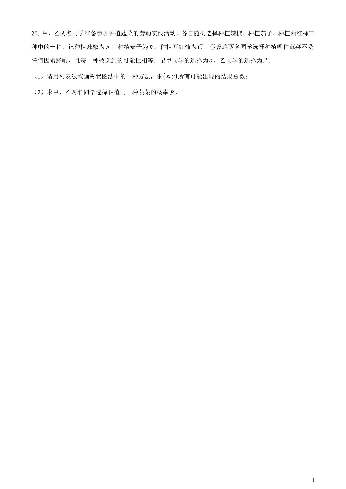
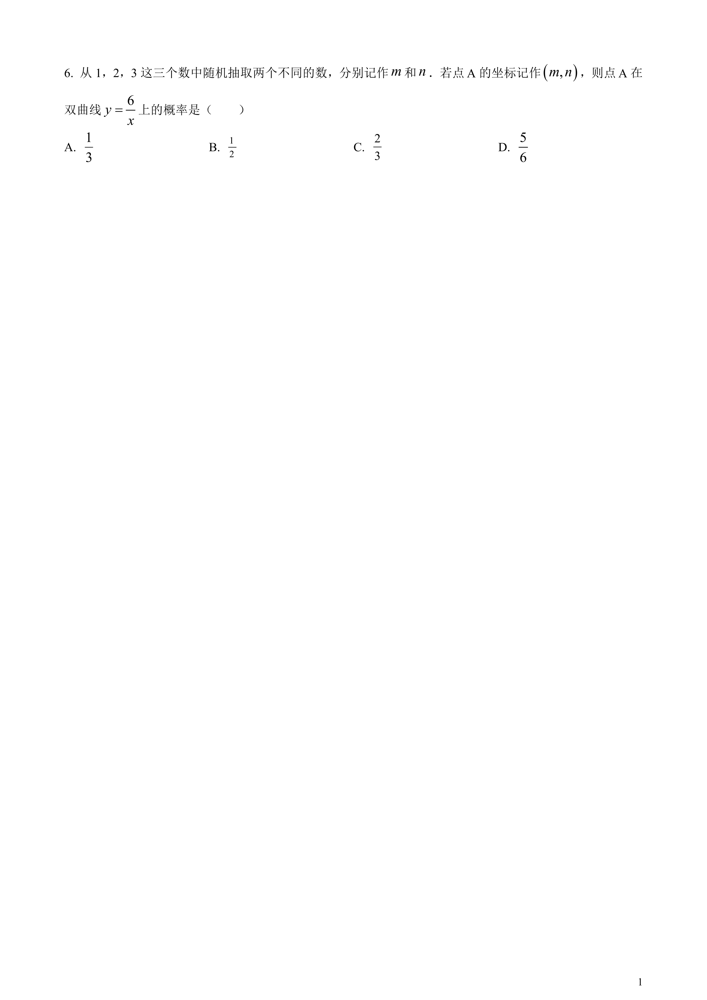
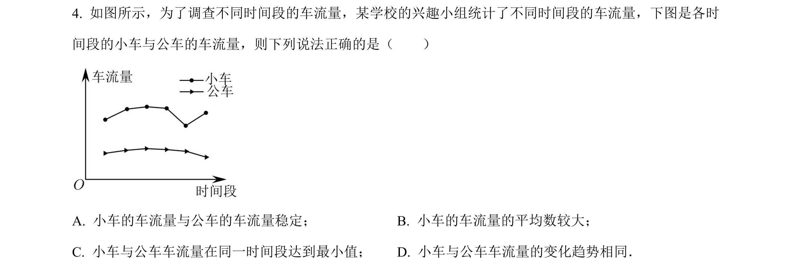
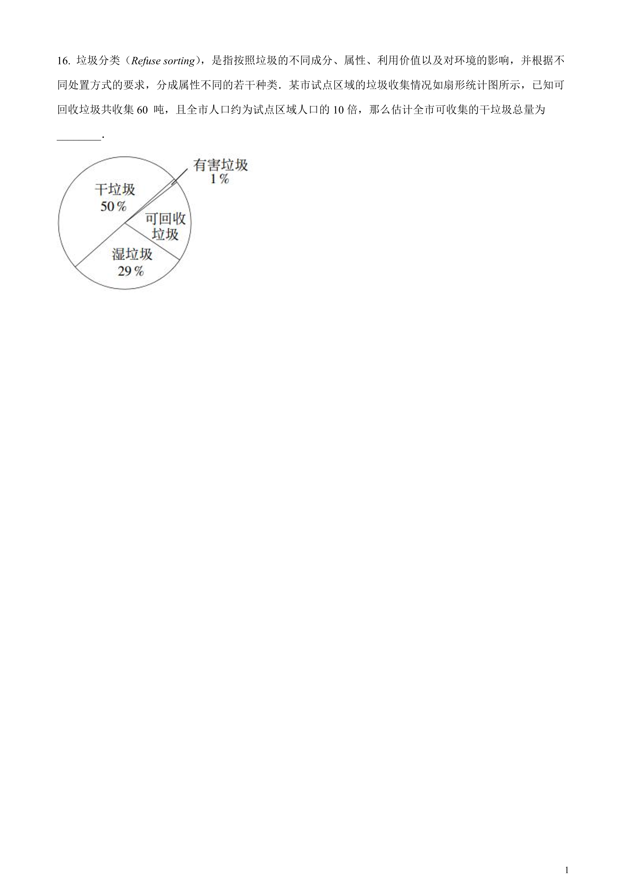
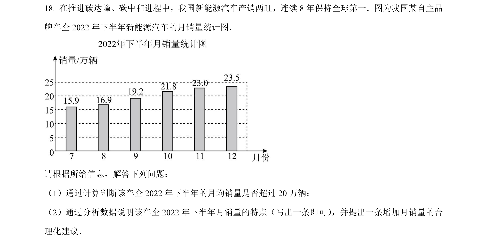
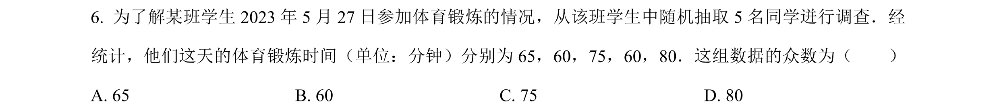
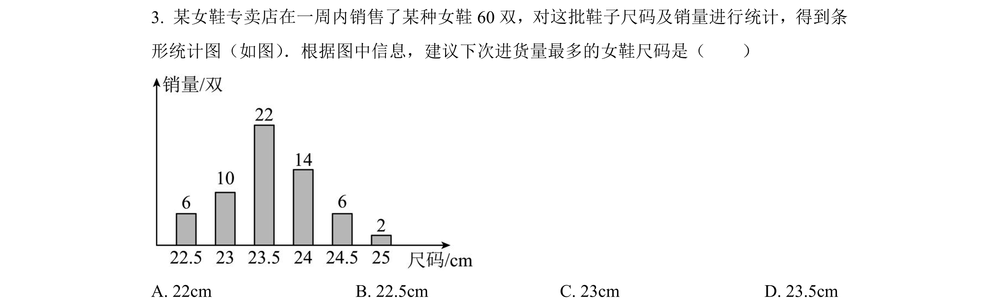

## 概率论与数理统计

### 概率
##### 2023年/12题/上海省级 
##### 2023年/20题/云南省级 
##### 2023年/06题/内蒙包头 
### 统计
#### 统计分析
#####  2023年/04题/上海省级 
#####  2023年/16题/上海省级 
#####  2023年/19题/云南省级 
##### 2023年/18题/内蒙包头 

#### 众数与中位数 
##### 2023年/15题/云南省级 
##### 2023年/15题/四川南充 

